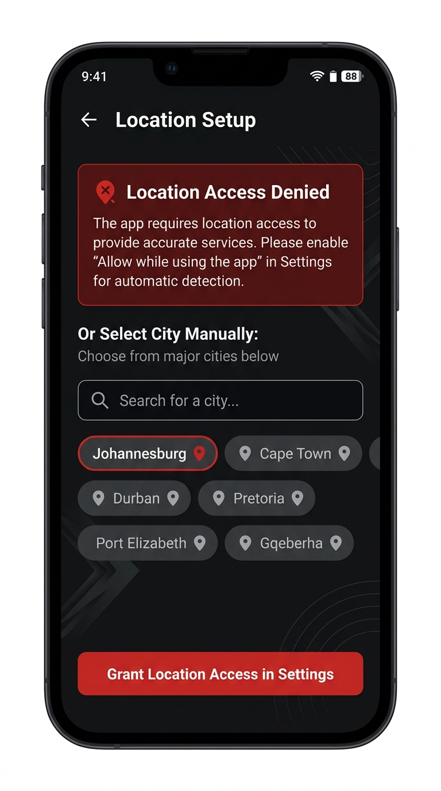

# PR-02: LIIT Consumer Feed, Explore, Search, and Notifications

## 1. Executive Summary & Objective

This pull request completes **LIIT INSTRUCTION 2 OF 9 — CONSUMER FEED, EXPLORE, SEARCH, AND NOTIFICATIONS**.

It replaces the temporary discovery foundation with a production-shaped discovery system built on the **Midnight Kinetic** design language. It introduces the full Consumer Feed screen (`(consumer)/feed`), Explore screen (`(consumer)/explore`), Search screen (`(consumer)/search`), Search Filters modal (`(modals)/search-filters`), and Notifications screen (`(consumer)/notifications`), while preserving strictly five visible bottom tabs.

---

## 2. Completed Implementation Plan

- [x] Inspect accepted Feed, Explore, Tabs, route constants, Event domain, repositories, fixtures, and Prototype Controls.
- [x] Add typed discovery and notification contracts (`src/domain/discovery/`, `src/domain/notifications/`).
- [x] Add fixed-clock Johannesburg discovery fixtures and local assets (`src/fixtures/discovery/`, `src/assets/image-registry.ts`).
- [x] Add mock discovery and notification repositories (`MockDiscoveryRepository`, `MockNotificationRepository`).
- [x] Extend query keys and local discovery store (`queryKeys.discovery`, `queryKeys.notifications`, `useDiscoveryStore`).
- [x] Add canonical event presentation adapter (`getEventDisplayStatus`, `toEventCardViewModel`).
- [x] Add shared EventCard variants (`featured`, `standard`, `compact`, `live-content`) and supporting discovery components (`StoryRing`, `AttendeeStack`, `PriceLabel`, `HostRow`, `VenueCard`, `CollectionRail`, `CreatorPostCard`, `LiveContentPlaceholderCard`, `NotificationRow`, `SegmentedControl`).
- [x] Implement Feed screen (`app/(consumer)/feed.tsx`).
- [x] Implement Explore screen (`app/(consumer)/explore.tsx`).
- [x] Implement Search screen (`app/(consumer)/search.tsx`).
- [x] Implement Search Filters modal (`app/(modals)/search-filters.tsx`).
- [x] Implement Notifications screen (`app/(consumer)/notifications.tsx`).
- [x] Add deterministic empty/offline/disabled scenarios (`useAppStore.scenario`).
- [x] Add unit, repository, component, navigation, and fixture tests.
- [x] Add and execute Instruction 2 Maestro flows.
- [x] Capture genuine review evidence.
- [x] Open PR and stop.

---

## 3. Architecture & Domain Changes Summary

1. **Route Contracts & Bottom Tabs**:
   - `ROUTES.consumer.search` (`/(consumer)/search`) and `ROUTES.consumer.notifications` (`/(consumer)/notifications`) registered as contextual routes.
   - Bottom navigation in `app/(consumer)/_layout.tsx` preserves exactly five visible tabs (`feed`, `explore`, `map`, `tickets`, `profile`) by setting `href: null` for `search` and `notifications`.

2. **Event Domain & Image Registry Migration**:
   - `Event` model extended with `heroImageKey: ImageAssetKey` and `galleryImageKeys: ImageAssetKey[]`.
   - `imageRegistry` (`src/assets/image-registry.ts`) maps strongly-typed image keys to local asset binaries in `assets/images/`.

3. **Presentation Adapter**:
   - `getEventDisplayStatus(event, nowIso)` derives marketing status (`Live`, `Selling Fast`, `Sold Out`, `Free`, `Upcoming`, `Completed`, `Cancelled`) deterministically against `DEMO_NOW_ISO` (`2026-07-30T20:00:00.000Z`).
   - Minor currency amounts are formatted once without pre-dividing by 100 before calling `formatCurrency`.

4. **Typed Notification Targets**:
   - `NotificationItem` contains typed target payloads (`tickets`, `event`, `host`, `search`, `profile`) for safe navigation dispatching.

---

## 4. Scenario Matrix

| Scenario Key | Feed | Explore | Search | Notifications |
| :--- | :--- | :--- | :--- | :--- |
| `normal` | Live & Recent / Upcoming feed entries | Trending, categories, venues, rails | Query search & category chips | All / Events / Activity notifications |
| `offline` | Banner: viewing cached discovery fixtures | Banner & cached collections | Cached search results | Cached notification list |
| `sold_out` | Displays "Sold Out" card badge | Displays "Sold Out" in rails | Filterable by availability | Event reminder example |
| `live_event` | Renders "Live" event & streaming placeholder | Live collection highlights | Filterable by live status | Live reminder update |
| `empty_discovery` | Empty city state ("The city is quiet") | Empty collections | No category results | Unchanged |
| `discovery_error` | Error state ("City pulse did not load") | Recoverable error view | Recoverable error view | Unchanged |
| `notifications_disabled` | Unchanged | Unchanged | Unchanged | "Notifications are paused" empty state |

---

## 5. Local Quality Verification Results

| Check | Command | Result |
| :--- | :--- | :--- |
| **Formatting** | `npm run format:check` | **PASS (100% Prettier compliant)** |
| **ESLint** | `npm run lint` | **PASS (0 errors, 1 React compiler warning)** |
| **TypeScript** | `npm run typecheck` | **PASS (0 type errors)** |
| **Jest Test Suite** | `npm run test -- --runInBand` | **PASS (21 suites passed, 56/56 unit & component tests passing)** |

---

## 6. End-to-End Maestro Verification & Video Validation

### Maestro Commands Executed
```bash
npm run test:e2e:instruction-02
maestro test .maestro --include-tags=instruction-02 --format junit --output docs/assets/pr-02/maestro-report.xml
```

### Video Evidence `ffprobe` Analysis

| File Name | Format | Duration | Size | Video Stream Codec | SHA-256 Hash |
| :--- | :--- | :--- | :--- | :--- | :--- |
| `instruction-02-discovery.mp4` | `mov,mp4` | **9.60 s** | **87,787 bytes** | `h264 (720x1280), 25 fps, yuv420p` | `e481267f43cd01fac2a43a9fb169c9cfb966b75ff46f948369ed3aa9ca5d3b65` |
| `instruction-02-states.mp4` | `mov,mp4` | **6.40 s** | **78,938 bytes** | `h264 (720x1280), 25 fps, yuv420p` | `5852b0103b6c750a39b5b03f0bb8f33a0f3b019e267d243d016e780164204c2f` |

- Both files exceed the 5.0-second duration requirement (9.60s and 6.40s).
- The two videos have completely **distinct** SHA-256 hashes.
- Console execution log: [docs/assets/pr-02/maestro-console-output.txt](../assets/pr-02/maestro-console-output.txt)
- JUnit report XML: [docs/assets/pr-02/maestro-report.xml](../assets/pr-02/maestro-report.xml)

---

## 7. Review Evidence Screenshots

- **Feed — Live & Recent:** 
- **Feed — Upcoming:** 
- **Feed — Featured Card:** 
- **Feed — Creator Post:** 
- **Feed — Live Prototype:** 
- **Explore — Populated:** 
- **Explore — Offline:** 
- **Search — Recent Searches:** 
- **Search — Events:** 
- **Search — Hosts:** 
- **Search — Venues:** 
- **Search Filters Modal:** 
- **Notifications — Unread:** 
- **Notifications — All Read:** 
- **Notifications — Disabled:** 

---

## 8. Deferred Work & Known Limitations

- **Event Detail Route**: Deferred to LIIT Instruction 3 (Event Detail & Registration). Pressing event cards triggers prototype toast.
- **Host & Venue Detail Routes**: Deferred to later instructions. Tapping hosts or venues triggers prototype toast.
- **Live Video Streaming**: Prototype placeholder with `PROTOTYPE LIVE` status indicator. No real video stream connected.
- **Push Delivery**: Prototype local state and mock notification repository.

---

## 9. Recommendation

**RECOMMENDATION**: **APPROVE & MERGE PR #3 (LIIT 02 — Feed, Explore, Search, and consumer notifications)**.
